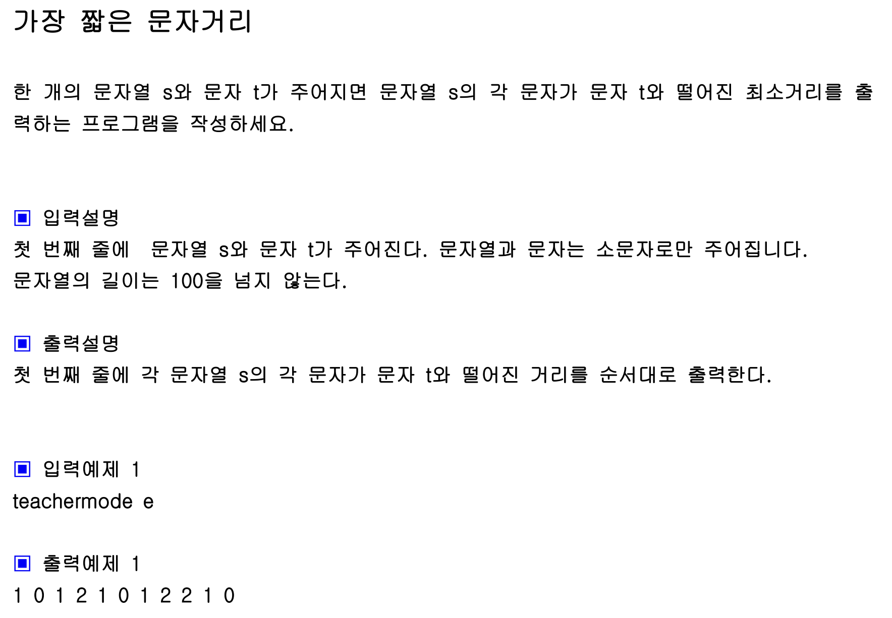

## 내 코드 1
```javascript
function solution(s, t){
    let answer=[];
    let idxArr=[];

    //문자 t의 인덱스를 idxArr에 저장한다.
    let i = s.indexOf(t);
    idxArr.push(i);
    while(i !== -1){
        i = s.indexOf(t,i+1);
        if(i !== -1){
            idxArr.push(i);
        }
    }

    let j = 0;
    for(let i = 0 ; i< s.length ; i++){
        if(j+1<=idxArr.length-1){//현재 idxArr[j]와 idxArr[j+1]의 값과 i값을 비교하여 더 작은 수를 answer에 넣어준다. 
            let tmp = Math.min(Math.abs(idxArr[j]-i), idxArr[j+1]-i);
            answer.push(tmp);
        }
        else{
            //마지막 j에 왔을 경우는 i가 idxArr[j]보다 크다
            answer.push(i-idxArr[j])
        }
        if(i === idxArr[j+1]){//i와 idxArr[j+1]값이 같으면 j++하여 j를 계속해서 비교할 수 있게 해준다.
            j++;
        }
    }

    return answer;
}

let str="teachermode";
console.log(solution(str, 'e'));
```  

## 내 코드 2
```javascript
function solution(s, t){
    let charIndex = [];
    let answer = [];
    let i = 0;

    //문자 t의 인덱스를 charIndex에 저장한다.
    while(true){
        i = s.indexOf(t,i);
        if(i === -1){
            break;
        }
        charIndex.push(i);
        i++;
    }
    let k = 0;
    for(let i = 0; i< s.length ; i++){
        if(s[i] !== t){
            while(1){
                if(i < charIndex[k]){//초기에 i가 최초 charIndex[k]를 만나기 전까지(charIndex[k]<i)
                    let distance = charIndex[k]-i;
                    answer.push(distance);
                    break;
                }
                else if(k+1 <charIndex.length && i > charIndex[k] && i <charIndex[k+1]){//charIndex[k] < i < charIndex[k+1] 일 때
                    let distance = Math.min(i-charIndex[k],charIndex[k+1]-i);
                    answer.push(distance);
                    break;

                }else if(k === charIndex.length-1){//k가 charIndex배열의 마지막 인덱스까지 왔을 때 처리(charIndex[k] < i)
                    let distance = i-charIndex[k];
                    answer.push(distance);
                    break;
                }
                else{
                    k++;
                }
            }

        }else{// s[i] === t라면 문자열 최소거리가 0이다!
            answer.push(0);
        }
    }

    return answer;
}

let str="teachermodea";
console.log(solution(str, 'e'));ㄴ
```  
시간을 두고 다시 풀어봤다. 내 코드 1 보다 더 나은 점은 각 조건별로 분기가 더욱 가독성있게 나누어져 있다.


## Solution
```javascript
            function solution(s, t){
                let answer=[];
                let p=1000;
                for(let x of s){
                    if(x===t){
                        p=0;
                        answer.push(p);
                    }
                    else{
                        p++;
                        answer.push(p);
                    }
                }
                p=1000;
                for(let i=s.length-1; i>=0; i--){
                    if(s[i]===t) p=0;
                    else{
                        p++;
                        answer[i]=Math.min(answer[i], p);
                    }
                }
                return answer;
            }
            
            let str="teachermode";
            console.log(solution(str, 'e'));
            ```
왼쪽에서부터 t와 떨어진 거리를 먼저 구한 후, 오른쪽에서부터 t와 떨어진 거리를 구해서 최솟값으로 answer 배열에 넣어준다.
