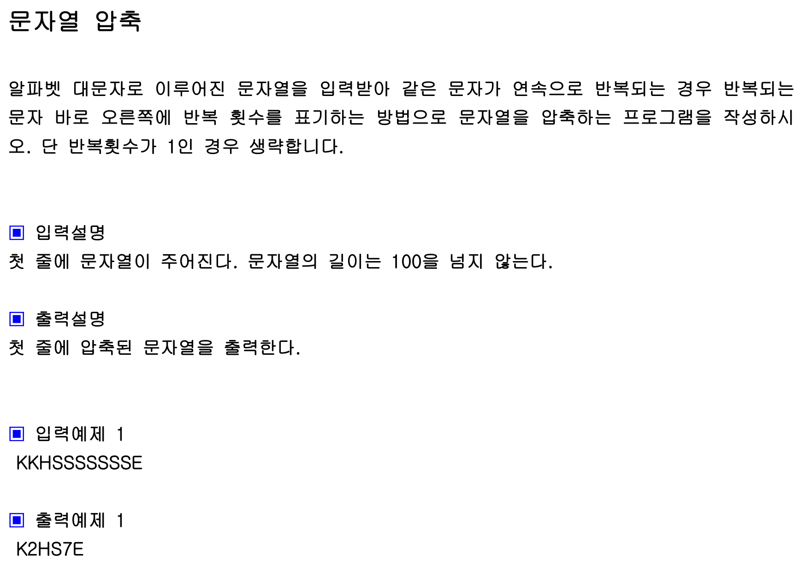

## 내 코드 
```javascript
function solution(s){
    let answer="";
    cnt=1
    let currentChar =''
    for(let i = 0; i< s.length; i++){
         currentChar = s[i];
  
        if(i+1<s.length){
            if(currentChar === s[i+1]){
                cnt++;
            }
            else{
                if(cnt === 1){
                    answer+=currentChar
                }else{
                    answer+=currentChar+String(cnt);
                    cnt=1
                }
    
            }
        }else{
            if(cnt === 1){
                answer+=currentChar
            }else{
                answer+=currentChar+String(cnt);
            }
        }
       
    }
    
   
    return answer;
}

let str="KKHSSSSSSSE";
console.log(solution(str));
```  

## Solution
```javascript
            function solution(s){
                let answer="";
                let cnt=1;
                s=s+" "; //이 부분 설명!
                for(let i=0; i<s.length-1; i++){
                    if(s[i]===s[i+1]) cnt++;
                    else{
                        answer+=s[i];
                        if(cnt>1) answer+=String(cnt);
                        cnt=1;
                    }
                }
                return answer;
            }
            
            let str="KKHSSSSSSSE";
            console.log(solution(str));
```  

항상 뒤의 문자와 현재 문자가 같은지 비교해야 하는데 가장 끝의 문자는 비교할 다음 문자가 없으므로 빈 문자열을 더해준다.