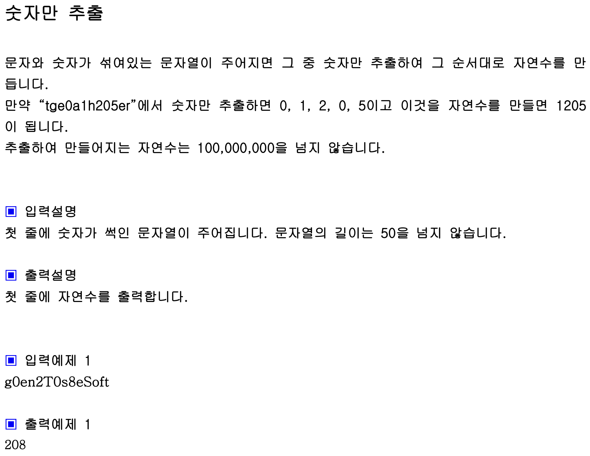

## 내 코드 
```javascript
function solution(str){
    let num='';
    for(let x of str){
        if(!isNaN(x)) num +=x; //is Not a Number
    }
    //num = str.replace(/[^0-9]/g,""); //정규식을 이용해서 숫자만 남기는 것도 가능! replace는 새로운 문자열을 리턴하므로 변수에 대입해줘야 함
    return Number(num);
}

let str="g0en2T0s8eSoft";
console.log(solution(str));
```  

