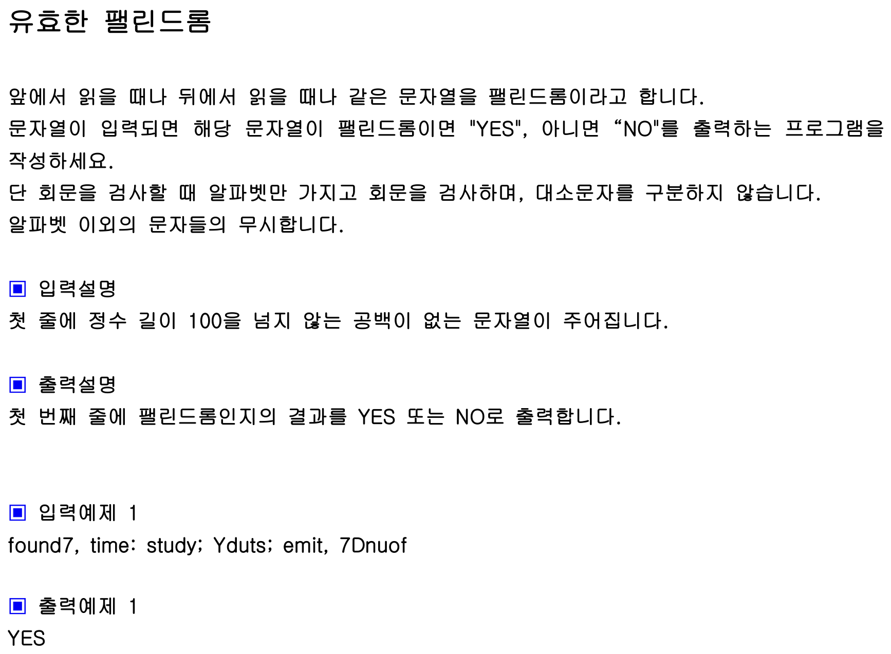

## 내 코드 
```javascript
function solution(s){
   s=s.toLowerCase();
   for(let i = 0;i<s.length ; i++){
    if(!(97 <= s[i].charCodeAt() && s[i].charCodeAt() <= 122)){
        // s.replace(s[i],'');
        s = s.substring(0,i) + s.substring(i+1);
        i--;//연속된 제거해야할 문자가 있을 때 제거되면서 i값은 커지는데 제거해야할 인덱스 값을 커버하지 못하므로 낮춰줌
    }
   }
   if(s === s.split('').reverse().join('')){
    return "YES";
   }
    return "NO";
}

let str="found7, time: study; Yduts; emit, 7Dnuoff";
console.log(solution(str));
```  


## Solution
```javascript
function solution(s){
    let answer="YES";
    s=s.toLowerCase().replace(/[^a-z]/g, '');
    if(s.split('').reverse().join('')!==s) return "NO";
        return answer;
    }
            
    let str="found7, time: study; Yduts; emit, 7Dnuof";
    console.log(solution(str));
 ```

정규식을 이용해서 알파벳이 아닌 다른 것들은 ''로 간단하게 치환했다.