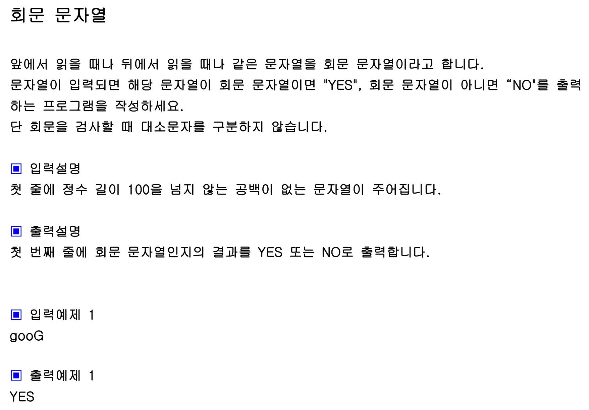

```javascript
function solution(s){
let length = Math.floor(s.length / 2);
let i = 0;
let j = s.length-1;

    for(let k = 0; k<length ; k++){
        if(s[i].toUpperCase() !== s[j].toUpperCase())
            return "NO";
         else i++; j--;
    }
    return "YES";
}

let str="goooG";
console.log(solution(str));
```