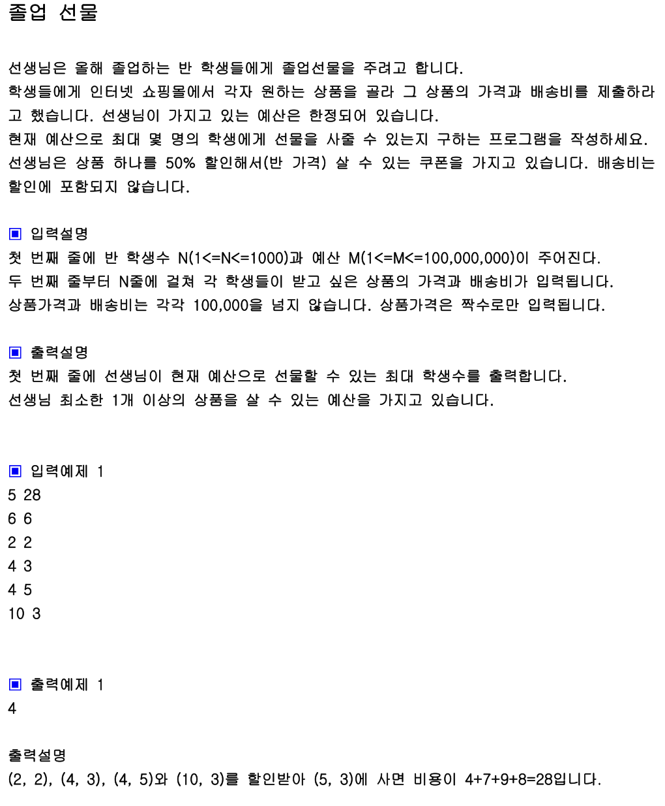

## 내 코드 
```javascript
function solution(m, product){
    let answer=0;
    let sum = Array.from({ length: product.length }, ()=>0);//0으로 초기화

    //sum 배열에 일단 상품과 배송비 합을 다 구해놓는다.
    for(let i = 0; i<product.length ; i++){
        sum[i] += product[i][0] + product[i][1];
    }
   

    //상품 1/2 가격을 차례로 i 포문을 돌며 빼고 정렬 후 가장 많이 사줄 수 있는 맥스값을 구한다.
    for(let i = 0; i<product.length ; i++){
        let copySum = sum.slice();
        copySum[i] -= product[i][0]/2
        copySum.sort((a,b)=>a-b);
        let tmpM = m;
        for(let j = 0; j<product.length ; j++){
            tmpM -= copySum[j];
            if(tmpM<= 0){
                answer = Math.max(answer,j+1)
                break;
            }
        }
        
    }
    return answer;
}

let arr=[[6, 6], [2, 2], [4, 3], [4, 5], [10, 3]];
console.log(solution(28, arr));
```  
내가 푼 방법은 일단 상품 + 배송비 배열을 구해 놓고 완전탐색으로 하나씩 1/2 가격을 빼가면서 가장 많이 구매할 수 있는 최대값을 구했다.

## Solution
```javascript
            function solution(m, product){
                let answer=0;
                let n=product.length;
                product.sort((a, b)=>(a[0]+a[1])-(b[0]+b[1]));
                for(let i=0; i<n; i++){
                    let money=m-(product[i][0]/2+product[i][1]);
                    let cnt=1;
                    for(let j=0; j<n; j++){
                        if(j!==i && (product[j][0]+product[j][1])>money) break;
                        if(j!==i && (product[j][0]+product[j][1])<=money){
                            money-=(product[j][0]+product[j][1]);
                            cnt++;
                        }
                    }
                    answer=Math.max(answer, cnt);
                }  
                return answer;
            }
            
            let arr=[[6, 6], [2, 2], [4, 3], [4, 5], [10, 3]];
            console.log(solution(28, arr));
```  

Solution코드는 for문으로 하나씩 완전탐색 방법으로 상품값의 1/2 가격을 뺀 후 총 예산에서 빼가면서 가장 큰 answer값을 찾고 있다.