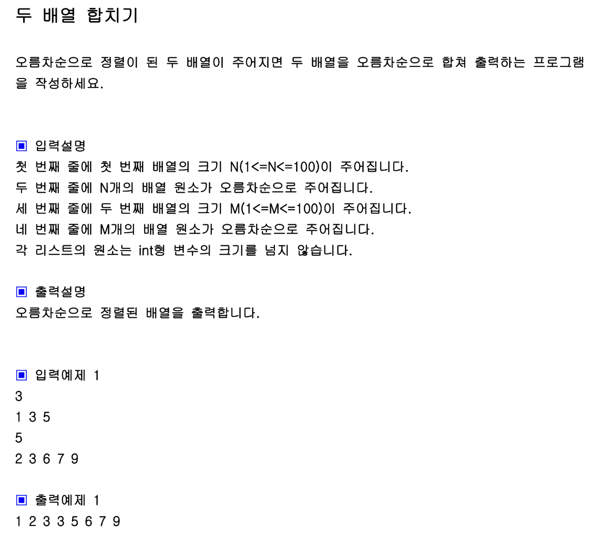

## 내 코드 
```javascript
function solution(arr1, arr2){
    let j = 0;
    let k = arr2[j];
    let copyArr1 = arr1.slice();
    for(let i = 0 ; i<arr1.length; i++){
       if(arr1[i] >= k){
            copyArr1.splice(i,0,arr2[j]);
            j++;
       }
    }
    if(k<arr2.length){
        copyArr1.push(...arr2.slice(k))
    }
    return copyArr1;
}

let a=[1, 3, 5];
let b=[2, 3, 6, 7, 9];
console.log(solution(a, b));
```
기준 배열 arr1을 잡아놓고 arr2의 원소들을 사이사이에 집어넣는 방식


## Solution
```javascript
function solution(arr1, arr2){
    let answer=[];
    let n=arr1.length;
    let m=arr2.length;
    let p1=p2=0;
    while(p1<n && p2<m){
        if(arr1[p1]<=arr2[p2]) answer.push(arr1[p1++]);
        else answer.push(arr2[p2++]);
    }
    while(p1<n) answer.push(arr1[p1++]);
    while(p2<m) answer.push(arr2[p2++]); 
    return answer;
}

let a=[1, 3, 5];
let b=[2, 3, 6, 7, 9];
console.log(solution(a, b));
```  
두 개의 포인터 p1, p2를 잡아서 차례로 arr1과 arr2를 비교하며 answer 배열을 만들어 가는 방식

