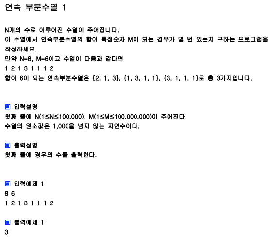

## 내 코드

```javascript
function solution(m, arr) {
  let answer = 0;

  for (let i = 0; i < arr.length - 2; i++) {
    let temp = 0;
    temp += arr[i];
    let j = i + 1;
    while (temp < m) {
      temp += arr[j];
      j++;
    }
    if (temp === m) {
      answer++;
    }
  }

  return answer;
}

function solution2(m, arr) {
  let answer = 0,
    temp = 0,
    i = 0;
  temp += arr[0];

  let j = 1;

  while (j < arr.length) {
    if (temp === m) {
      answer++;
    } else if (temp > m) {
      temp -= arr[i];
      i++;
      continue;
    }
    temp += arr[j];
    j++;
  }

  return answer;
}

let a = [1, 2, 1, 3, 1, 1, 1, 2];
console.log(solution2(6, a));
```

solution1은 O(N^2)이고
solution2는 O(N)이다.
안 좋은 습관 같은게 분기에 따른 순서를 생각하지 않고 일단 코드를 짜보는 경향이 있는데 꼬이면 시간을 더 잡아먹는 것 같다.
분기와 순서를 먼저 정확히 생각하고 짜야 될 것 같다.

## Solution

```javascript
function solution(m, arr) {
  let answer = 0,
    lt = 0,
    sum = 0;
  for (let rt = 0; rt < arr.length; rt++) {
    sum += arr[rt];
    if (sum === m) answer++;
    while (sum >= m) {
      sum -= arr[lt++];
      if (sum === m) answer++;
    }
  }
  return answer;
}

let a = [1, 2, 1, 3, 1, 1, 1, 2];
console.log(solution(6, a));
```
