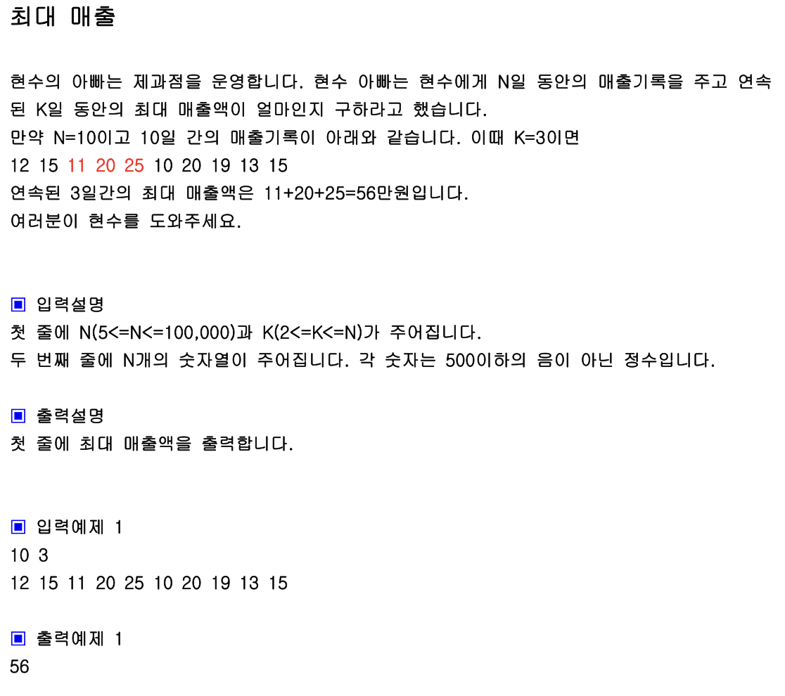

## 내 코드

```javascript
function solution(k, arr) {
  let answer = -1,
    sum = 0;
  for (let i = 0; i < arr.length - k; i++) {
    sum = 0;
    for (let j = 0; j < k; j++) {
      sum += arr[i + j];
    }
    answer = Math.max(answer, sum);
  }

  return answer;
}

let a = [12, 15, 11, 20, 25, 10, 20, 19, 13, 15];
console.log(solution(3, a));
```

슬라이딩 윈도우 개념 강의 들은 후

```javascript
function solution2(k, arr) {
  let answer = 0,
    sum = 0;
  for (let j = 0; j < k; j++) {
    sum += arr[j];
  }
  answer = sum;

  for (let i = k; i < arr.length; i++) {
    sum += arr[i];
    sum -= arr[i - k];
    answer = Math.max(answer, sum);
  }

  return answer;
}

let b = [12, 15, 11, 20, 25, 10, 20, 19, 13, 15];
console.log(solution(3, b));
```

solution과 내 코드가 같아서 생략
