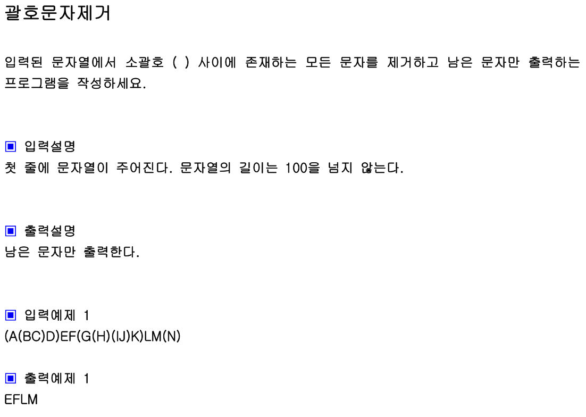

## 내 코드

```javascript
function solution(s) {
  let answer = Array.from(s);
  let close = 0;
  for (let i = s.length - 1; i >= 0; i--) {
    if (s[i] === ")") {
      answer.splice(i, 1);
      close++;
    } else if (s[i] === "(") {
      answer.splice(i, 1);
      close--;
    } else {
      if (close > 0) {
        answer.splice(i, 1);
      }
    }
  }
  return answer.join("");
}

let str = "(A(BC)D)EF(G(H)(IJ)K)LM(N)";
console.log(solution(str));
```

문자열의 끝 부분부터 처음부분으로 순회하면서 괄호 밖의 문자만 남긴다.

## Solution

```javascript
function solution(s) {
  let answer;
  let stack = [];
  for (let x of s) {
    if (x === ")") {
      while (stack.pop() !== "(");
    } else stack.push(x);
  }
  answer = stack.join("");
  return answer;
}

let str = "(A(BC)D)EF(G(H)(IJ)K)LM(N)";
console.log(solution(str));
```

s를 차례로 탐색하면서 닫는 괄호가 아니면 스택에 푸쉬,
닫는 괄호면 여는 괄호를 만날때까지 팝한다.
