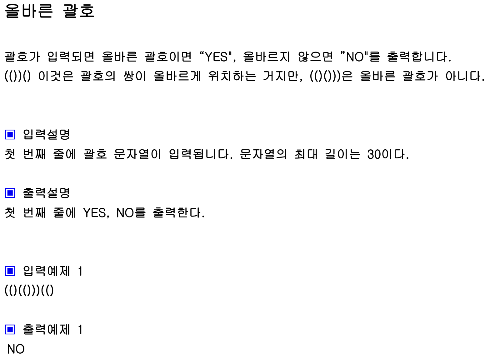

## 내 코드 
```javascript
function solution(s){
    let answer="YES";
    let arr = Array.from(s);
    let closeCnt = 0;

    while(arr.length > 0){
        let top = arr[arr.length - 1];
        if(top === '(' ){
            if(closeCnt > 0){
                closeCnt--;
                arr.pop();
            }else{
                return "NO";
            }
        }else{
            closeCnt++;
            arr.pop();
        }
    }
    return answer;
}


let a="(()(()))(()";
let b="(())(((())))"
let c="(()(()))(()"
console.log(solution(c));
```  
먼저 문자열s를 그대로 stack으로 만든 후 닫는 괄호를 만나면 closeCount++
여는 괄호는 closeCount가 0이상일 때만 스택에서 pop한다.

## Solution
```javascript
function solution(s){
    let answer="YES";
    stack=[];
    for(let x of s){
        if(x==='(') stack.push(x);
        else{
            if(stack.length===0) return "NO";
            stack.pop();
        }
    }
    if(stack.length>0) return "NO";  
    return answer;
}

let a="(()(()))(()";
console.log(solution(a));
```  
s를 차례로 탐색하면서 여는괄호면 스택에 푸쉬,
닫는 괄호면 여는 괄호가 이미 들어가 있으면 pop, 스택이 비었다면 NO 리턴

