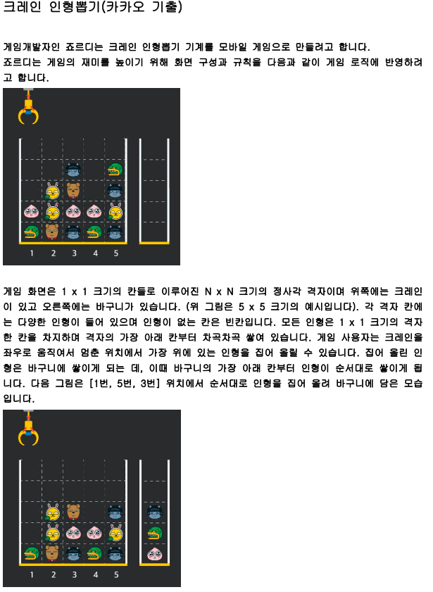
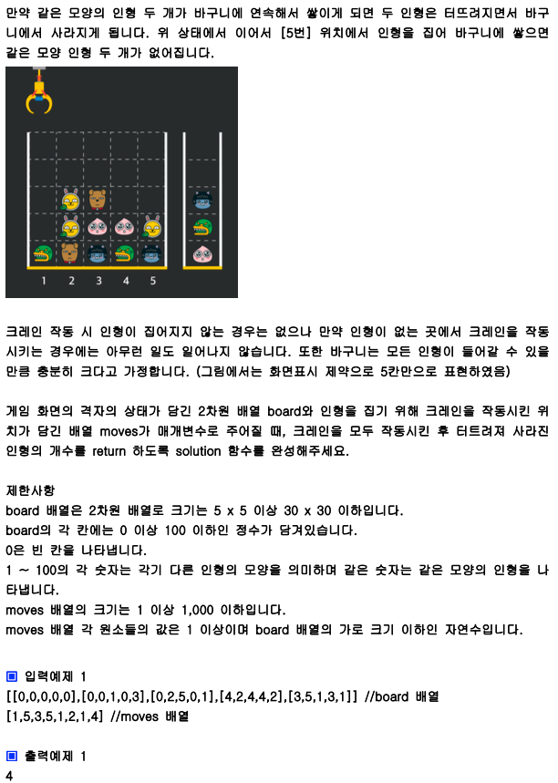

## 내 코드

```javascript
function solution(board, moves) {
  let st = [];
  let answer = 0;

  for (let m = 0; m < moves.length; m++) {
    let j = moves[m] - 1;
    let i = 0;
    if (board[board.length - 1][j] === 0) {
      //이미 board의 j열에 인형이 하나도 없는 경우는 continue  처리
      continue;
    }
    while (board[i][j] === 0) {
      //인형이 있을 때까지 i의 값을 올린다.
      i++;
    }
    if (st[st.length - 1] === board[i][j]) {
      //인형과 스택의 첫번째 인형이 같다면 스택에서 팝
      st.pop();
      answer++;
    } else {
      // 그렇지 않다면 푸쉬한다.
      st.push(board[i][j]);
    }

    board[i][j] = 0; //인형을 뽑은 부분은 0으로 만든다.
  }

  return answer * 2; //한번 터질 때 터지는 인형 갯수가 2개이므로 *2를 한다.
}

let a = [
  [0, 0, 0, 0, 0],
  [0, 0, 1, 0, 3],
  [0, 2, 5, 0, 1],
  [4, 2, 4, 4, 2],
  [3, 5, 1, 3, 1],
];

let b = [1, 5, 3, 5, 1, 2, 1, 4];
console.log(solution(a, b));
```

## Solution

```javascript
function solution(board, moves) {
  let answer = 0;
  let stack = [];
  moves.forEach((pos) => {
    for (let i = 0; i < board.length; i++) {
      if (board[i][pos - 1] !== 0) {
        let tmp = board[i][pos - 1];
        board[i][pos - 1] = 0;
        if (tmp === stack[stack.length - 1]) {
          stack.pop();
          answer += 2;
        } else stack.push(tmp);
        break;
      }
    }
  });

  return answer;
}

let a = [
  [0, 0, 0, 0, 0],
  [0, 0, 1, 0, 3],
  [0, 2, 5, 0, 1],
  [4, 2, 4, 4, 2],
  [3, 5, 1, 3, 1],
];

let b = [1, 5, 3, 5, 1, 2, 1, 4];
console.log(solution(a, b));
```
