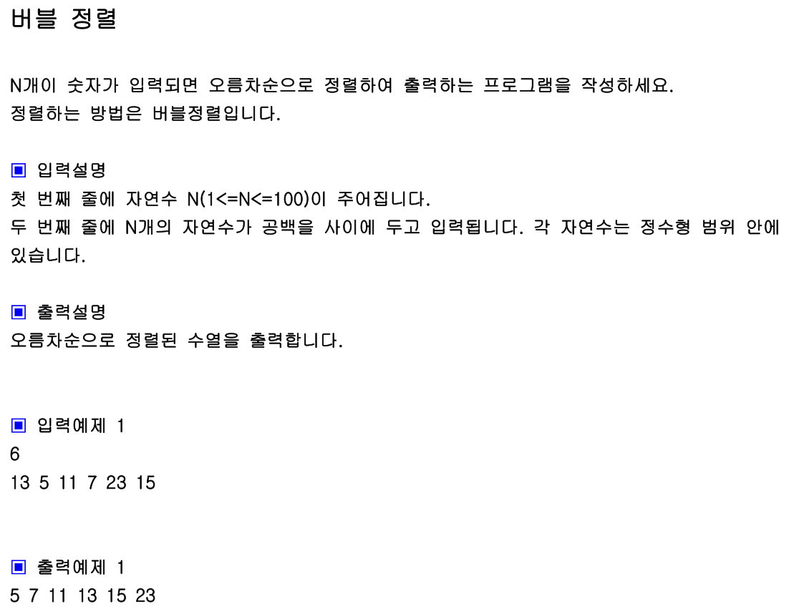

## 내 코드 
```javascript
function solution(arr){
    let answer=arr;
    for(let i = 0 ;i<arr.length -1;i++){
        for(let j = 0; j<arr.length -i -1;j++){
            if(arr[j]>arr[j+1]){
                [arr[j],arr[j+1]] = [arr[j+1],arr[j]];
            }
        }
    }
    return answer;
}

let arr=[13, 5, 11, 7, 23, 15];
console.log(solution(arr)); 
```  
솔루션 코드와 내 코드가 같아서 솔루션 코드는 생략함.  


```  
[arr[i],arr[k]]=[arr[k],arr[i]];
```  
- 구조 분해 할당: 배열의 오른쪽 [arr[k], arr[i]]는 arr 배열에서 k 번째와 i 번째 요소를 추출하여 새로운 배열을 생성합니다. 이 배열은 임시적으로 두 요소의 값을 저장합니다.
- 값의 교환: 이제 왼쪽에 있는 [arr[i], arr[k]] 구조는 이 임시 배열의 값들을 arr 배열의 i 번째와 k 번째 위치에 할당합니다. 이는 사실상 두 변수의 값을 교환하는 과정입니다.