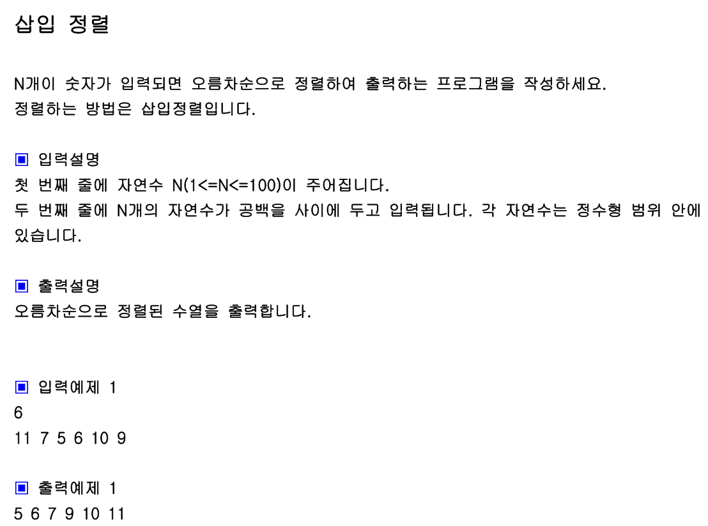

## 내 코드 
```javascript
function solution(arr){
    let answer=arr;
    for(let i = 1; i<arr.length ; i++){
        let tmp = arr[i];
        for(let j = i-1; j>=0 ; j--){
            if(arr[j]>tmp){
                arr[j+1] = arr[j];
            }else{
                arr[j+1] = tmp;
                break;
            }
            if(j === 0 ){
                arr[j] = tmp;
            }
        }
    }
    return answer;
}

let arr=[11, 7, 5, 6, 10, 9];
console.log(solution(arr));
```  
## Solution
```javascript
function solution(arr){
    let answer=arr;
    for(let i=0; i<arr.length; i++){
        let tmp=arr[i], j;
        for(j=i-1; j>=0; j--){
            if(arr[j]>tmp) arr[j+1]=arr[j];
            else break;
        }
        arr[j+1]=tmp;// j===-1되어서 여기로 오나 else break에서 여기로 오게 된다
    } 
    return answer;
}

let arr=[11, 7, 5, 6, 10, 9];
console.log(solution(arr));
```  