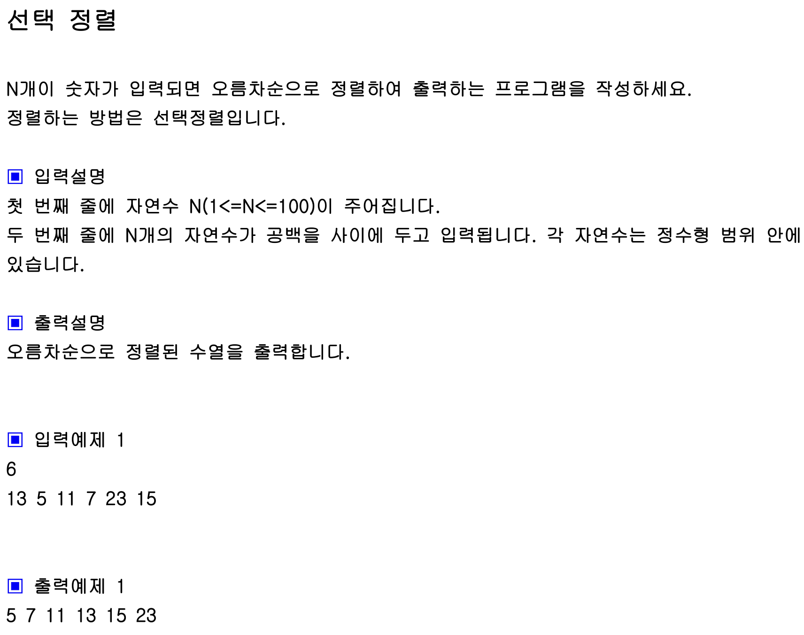

## 내 코드 
```javascript
function solution(arr){
    let i = 0;

    let k = 0;
    for(; i< arr.length ; i++){
        k = i;
        for(j = i+1; j<arr.length;j++){
            if(arr[k] > arr[j]){
                k = j;//j인덱스 값을 저장한다.
            }
        }
        // let tmp = arr[i];
        // arr[i] = arr[k];
        // arr[k] = tmp;

        [arr[i],arr[k]]=[arr[k],arr[i]];
    } 
    return arr;
}

let arr=[13, 5, 11, 7, 23, 15];
console.log(solution(arr));
```  
솔루션 코드와 내 코드가 같아서 솔루션 코드는 생략함.  


```  
[arr[i],arr[k]]=[arr[k],arr[i]];
```  
- 구조 분해 할당: 배열의 오른쪽 [arr[k], arr[i]]는 arr 배열에서 k 번째와 i 번째 요소를 추출하여 새로운 배열을 생성합니다. 이 배열은 임시적으로 두 요소의 값을 저장합니다.
- 값의 교환: 이제 왼쪽에 있는 [arr[i], arr[k]] 구조는 이 임시 배열의 값들을 arr 배열의 i 번째와 k 번째 위치에 할당합니다. 이는 사실상 두 변수의 값을 교환하는 과정입니다.