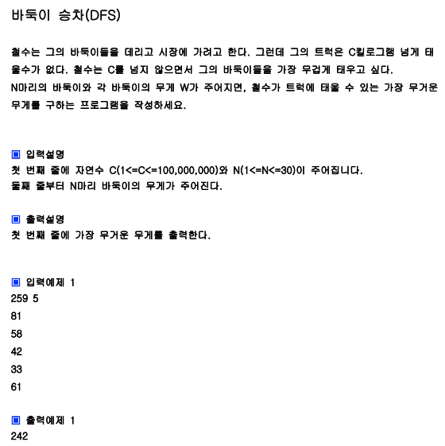

## 내 코드

```javascript
function solution(c, arr) {
  let answer = Number.MIN_SAFE_INTEGER;

  function dfs(i, sum) {
    if (i === arr.length) {
      answer = Math.max(answer, sum);
      console.log("i==length, answer=", answer);
      return;
    }
    if (sum + arr[i] > c) {
      //지금까지의 sum과 다음 바둑이의 합이 c초과라면 sum만 가지고 answer을 갱신함
      answer = Math.max(answer, sum);
      console.log("sum + arr[i] > c, answer=", answer);
      return;
    } else {
      sum += arr[i];
      dfs(i + 1, sum);
      sum -= arr[i];
      dfs(i + 1, sum);
    }
  }
  dfs(0, 0);

  return answer;
}

let arr = [81, 58, 42, 33, 61];
console.log(solution(259, arr));
```

## Solution

```javascript
function solution(c, arr) {
  let answer = Number.MIN_SAFE_INTEGER;
  let n = arr.length;
  function DFS(L, sum) {
    if (sum > c) return;
    if (L === n) {
      answer = Math.max(answer, sum);
    } else {
      DFS(L + 1, sum + arr[L]);
      DFS(L + 1, sum);
    }
  }
  DFS(0, 0);
  return answer;
}

let arr = [81, 58, 42, 33, 61];
console.log(solution(259, arr));
```

솔루션 코드가 더 나이스 한 것 같다!!  
바둑이 무게의 합이 c 초과일 경우 바로 리턴하도록 했고  
answer 갱신 부분은 L === n일 때 (모든 바둑이들을 태울지 안태울지 결정이 끝났을 때) 하는것이 더 로직이 직관적인 것 같다.
