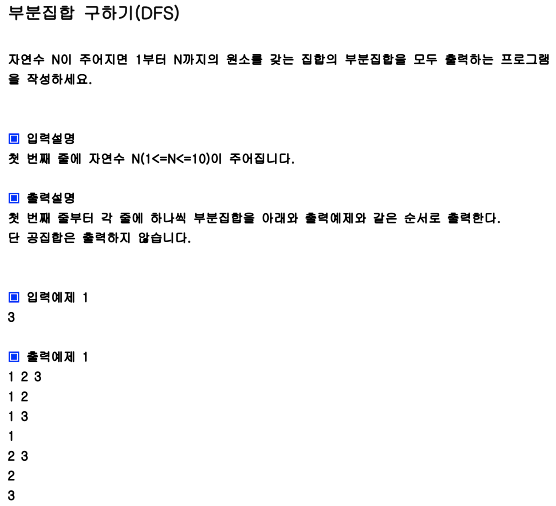

## 내 코드 
```javascript
function solution(n){
    let answer=[]
    let tmp=[];
    
    dfs(1,n)
    function dfs (m,n)  {
        if(n === 0){
            return; //공집합은 출력 제외이므로 바로 리턴한다.
        }
        if(tmp.length === n){
            answer.push(tmp.join(" "));// tmp= [1, 2, 3]이라면 tmp를  '1 2 3'으로 바꿔준다.
            return;
        }
        tmp.push(m); //m을 선택한다.
        dfs(m+1,n);
        tmp.pop(); //m을 선택하지 않고,
        dfs(m+1,n-1) //출력할 부분집합 원소 수를 줄여준다.
 
    }
    return answer;
}

console.log(solution(3));
```  

## Solution
```javascript
function solution(n){
    let answer=[];
    let ch=Array.from({length:n+1}, ()=>0);
    function DFS(L){
        if(L===n+1){
            let tmp="";
            for(let i=1; i<=n; i++){
                if(ch[i]===1) tmp+=(i+" ");
            }
            if(tmp.length>0) answer.push(tmp.trim());//공집합 제외해주는 부분
        }
        else{
            ch[L]=1;
            DFS(L+1);
            ch[L]=0;
            DFS(L+1);
        }
    }
    DFS(1);
    return answer;
}

console.log(solution(3));
```

솔루션 코드는 체크 배열을 따로 두어서 체크배열에 1로 표시한 원소들만 answer에 푸쉬하도록 했다.
