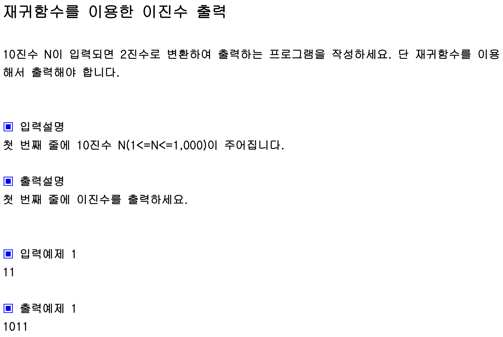

## 내 코드 
```javascript
function solution(n){
    let answer = ''
    
    dfs(n);
    return answer;
    
    function dfs(n){
        if(n === 0 ){
            return ;
        }
        //이 위치에 console.log(n%2) 하면 차례로 1101로 나온다. 순서대로 11나머지 1, 5나머지 1, 2 나머지 0, 1 나머지 1
        dfs(Math.floor(n/2)) 
        return answer+=n % 2; //이 위치는 1011, n을 2로 나눌 수 있을 때까지 재귀가 내려간 후에 실행된다. (1 나머지 1, 2 나머지 0, 5 나머지 1, 11 나머지 1)
    }
}

console.log(solution(11));
```