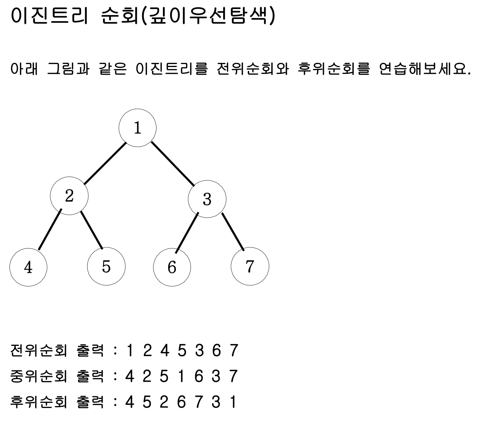

## 내 코드 
```javascript
//전위 순위
function solution(n){
    let answer="";
    dfs(n);
    function dfs(n){
        if(n > 7 ) return;
        answer+=n+' ';
        dfs(n * 2);
        dfs(n*2 + 1);

    }
    return answer;
}

console.log(solution(1));

//중위 순위
function solution2(n){
    let answer="";
    dfs(n);
    function dfs(n){
        if(n > 7 ) return;
        dfs(n * 2);
        answer+=n+' ';
        dfs(n*2 + 1);

    }
    return answer;
}

console.log(solution2(1));

//후위 순위
function solution3(n){
    let answer="";
    dfs(n);
    function dfs(n){
        if(n > 7 ) return;

        dfs(n * 2);
        dfs(n*2 + 1);
        answer+=n+' ';

    }
    return answer;
}

console.log(solution3(1));
```
solution 코드와 내 코드가 같아서 솔루션은 생략함