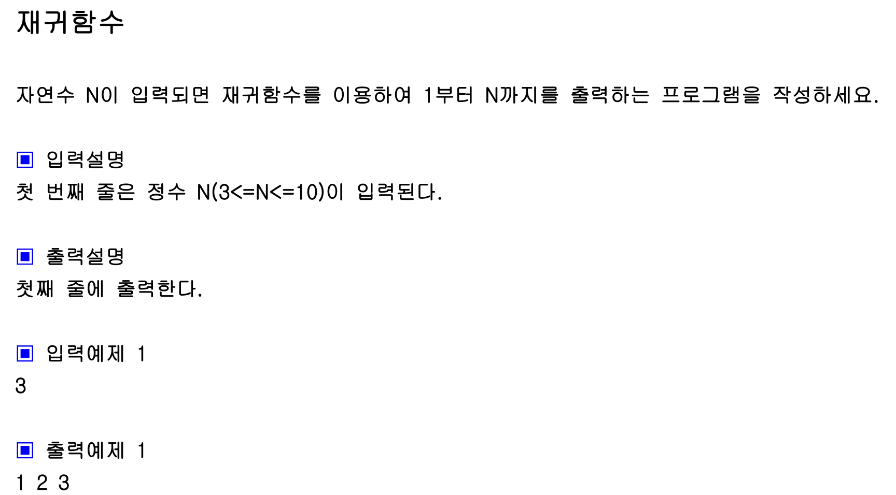

## 내 코드

```javascript
function solution(n) {
  let answer = dfs(n, 1, []);
  return answer;
}

function dfs(n, i, arr) {
  if (i > n) {
    return;
  }
  while (i <= n) {
    arr.push(i);
    i++;
    dfs(n, i, arr);
    return arr;
  }
}

console.log(solution(3));
```

## Solution

```javascript
function solution(n) {
  function DFS(L) {
    if (L == 0) return;
    else {
      DFS(L - 1);
      console.log(L);
    }
  }
  DFS(n);
}

solution(3);
```

재귀함수는 콜스택에 차례로 쌓인다!
