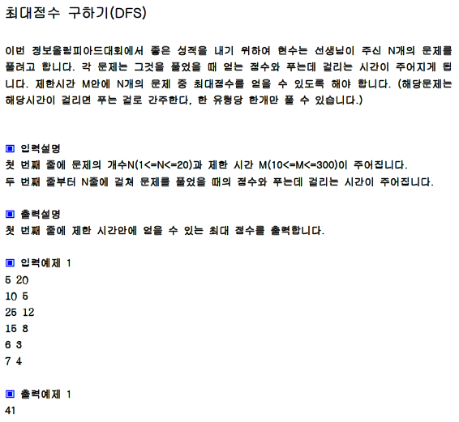

## 내 코드

```javascript
function solution(m, ps, pt) {
  let answer = Number.MIN_SAFE_INTEGER;
  let n = ps.length;

  function dfs(L, time, score) {
    //L : level
    if (time > m) return;
    if (L === n) {
      answer = Math.max(answer, score);
    } else {
      dfs(L + 1, time + pt[L], score + ps[L]);
      dfs(L + 1, time, score);
    }
  }
  dfs(0, 0, 0);
  return answer;
}

let ps = [10, 25, 15, 6, 7];
let pt = [5, 12, 8, 3, 4];
console.log(solution(20, ps, pt));
```

## Solution

```javascript
function solution(m, ps, pt) {
  let answer = Number.MIN_SAFE_INTEGER;
  let n = ps.length;
  function DFS(L, sum, time) {
    if (time > m) return;
    if (L === n) {
      answer = Math.max(answer, sum);
    } else {
      DFS(L + 1, sum + ps[L], time + pt[L]);
      DFS(L + 1, sum, time);
    }
  }

  DFS(0, 0, 0);
  return answer;
}

let ps = [10, 25, 15, 6, 7];
let pt = [5, 12, 8, 3, 4];
console.log(solution(20, ps, pt));
```

재귀함수는 콜스택에 차례로 쌓인다!
