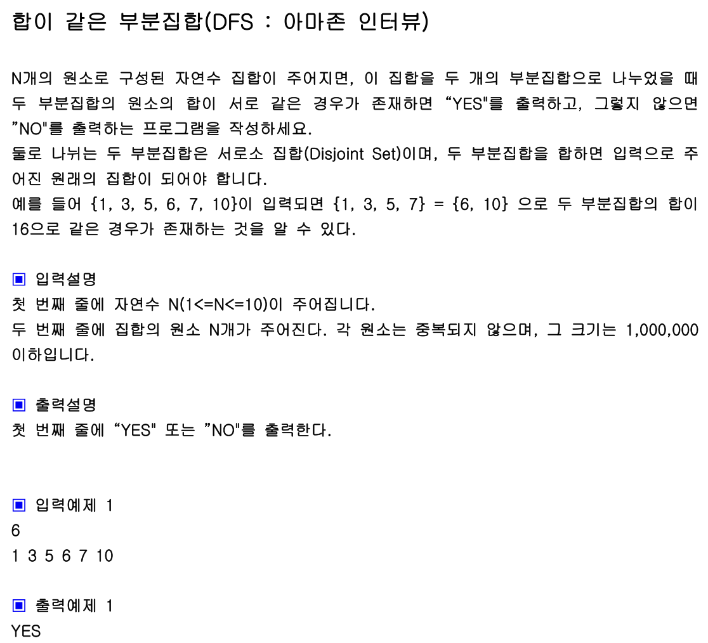

## 내 코드 
```javascript
function solution(arr){
    let answer="NO";
    let currentSum = 0;
    let sum = 0;
    for(let i = 0; i<arr.length ; i++){
        sum+=arr[i];
    }
    dfs(0);

    function dfs(i){
        if(i === arr.length) return;
        if(currentSum === sum / 2){
            answer = "YES";
        }else{
            currentSum+=arr[i];
            dfs(i+1);
            currentSum-=arr[i];
            dfs(i+1);
        }
    }
    return answer;
}

let arr=[1, 3, 5, 6, 7, 10];
console.log(solution(arr));
```
솔루션 코드가 더 나이스 하다 ㅎㅎ
## Solution
```javascript
function solution(arr){
    let answer="NO", flag=0;
    let total=arr.reduce((a, b)=>a+b, 0);
    let n=arr.length;
    function DFS(L, sum){
        if(flag) return; //플래그가 참이면 그 후로는 모두 리턴시켜서 쓸데 없이 재귀가 돌지 않게 한다.
        if(L===n){
            if((total-sum)===sum){
                answer="YES";
                flag=1;
            }
        }
        else{
            DFS(L+1, sum+arr[L]);
            DFS(L+1, sum);
        }
    }
    DFS(0, 0);
    return answer;
}

let arr=[1, 3, 5, 6, 7, 10];
console.log(solution(arr));
```
