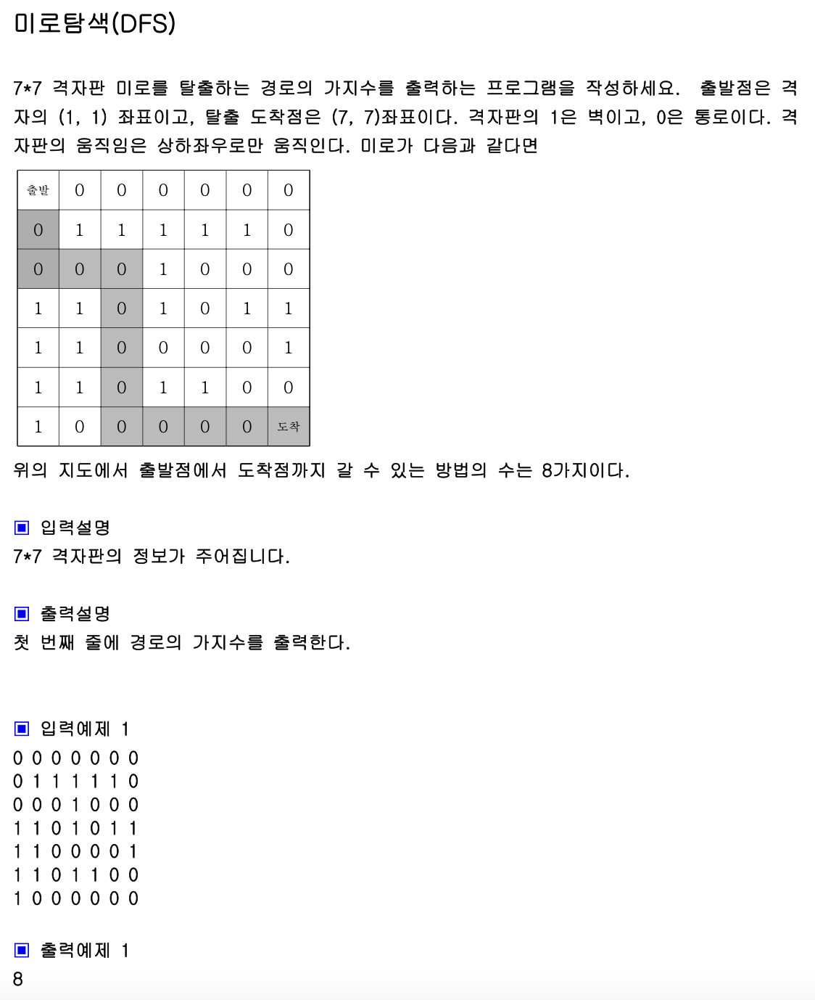

## 내 코드

```javascript
function solution(board) {
  let answer = 0;
  let dy = [1, 0, -1, 0];
  let dx = [0, 1, 0, -1]; //우, 하, 좌, 상
  let visited = Array.from(new Array(board.length), () =>
    new Array(board.length).fill(0)
  );
  visited[0][0] = 1;
  function dfs(x, y) {
    let nx;
    let ny;
    for (let k = 0; k < dx.length; k++) {
      nx = x + dx[k];
      ny = y + dy[k];
      if (nx >= 0 && nx < board.length && ny >= 0 && ny < board.length) {
        if (visited[nx][ny] !== 1 && board[nx][ny] === 0) {
          visited[nx][ny] = 1;
          if (nx === board.length - 1 && ny === board.length - 1) {
            answer++;
            visited[nx][ny] = 0;
          } else dfs(nx, ny);
        }
      }
    }
    if (x >= 0 && x < board.length && y >= 0 && y < board.length) {
      visited[x][y] = 0;
    }
  }
  dfs(0, 0);
  return answer;
}

let arr = [
  [0, 0, 0, 0, 0, 0, 0],
  [0, 1, 1, 1, 1, 1, 0],
  [0, 0, 0, 1, 0, 0, 0],
  [1, 1, 0, 1, 0, 1, 1],
  [1, 1, 0, 0, 0, 0, 1],
  [1, 1, 0, 1, 1, 0, 0],
  [1, 0, 0, 0, 0, 0, 0],
];

console.log(solution(arr));
```

이 코드를 짜고 디버깅하는데 너무 오래걸렸다.. 그 이유는..언제 다시 visited를 0으로 초기화하면서 백해줄건지에 대한 이해도가 떨어졌던 것 같다. 그런데 솔루션 코드를 보니 너무나 명확하게 dfs 성질을 이용해서 초기화를 해주고 있다,,
나는 dfs를 bfs비슷하게 푸느라 짬뽕 되어서 헷갈리고, 오래걸렸던 것 같은데 연습을 더 해봐야 겠다.

## Solution

```javascript
function solution2(board) {
  let answer = 0;
  let dx = [-1, 0, 1, 0];
  let dy = [0, 1, 0, -1];
  function DFS(x, y) {
    if (x === 6 && y === 6) answer++;
    else {
      for (let k = 0; k < 4; k++) {
        let nx = x + dx[k];
        let ny = y + dy[k];
        if (nx >= 0 && nx <= 6 && ny >= 0 && ny <= 6 && board[nx][ny] === 0) {
          board[nx][ny] = 1;
          DFS(nx, ny);
          board[nx][ny] = 0;
        }
      }
    }
  }
  board[0][0] = 1;
  DFS(0, 0);
  return answer;
}

let arr = [
  [0, 0, 0, 0, 0, 0, 0],
  [0, 1, 1, 1, 1, 1, 0],
  [0, 0, 0, 1, 0, 0, 0],
  [1, 1, 0, 1, 0, 1, 1],
  [1, 1, 0, 0, 0, 0, 1],
  [1, 1, 0, 1, 1, 0, 0],
  [1, 0, 0, 0, 0, 0, 0],
];

console.log(solution(arr));
```
